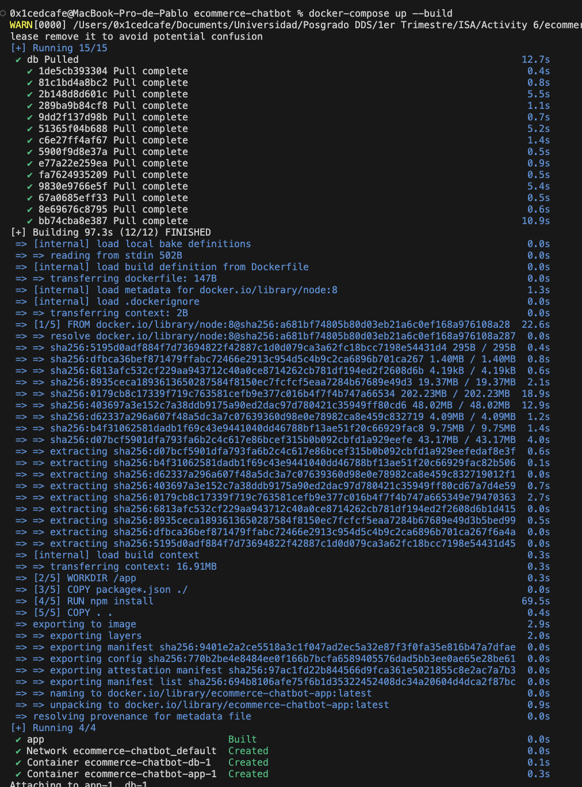

# Postmortem
## Part A — Demo

**Time to deploy:** 3:41 using just the `docker-compose up --build` command

**Extra posible time:** 6+ min to download and install Docker Desktop (On Windows). This may vary depending on the environment and internet speed.

## Part B — Executive Postmortem: 
### What Was Broken
The repository was essentially undeployable out of the box due to an undocumented, severely outdated Node 8 dependency and completely missing database setup instructions. New engineers would face a series of blockers including native compiling errors from deprecated `node-sass` versions, hardcoded credentials, and a silently failing database connection devoid of any initialization schema.

### What We Built
- **`Dockerfile`**: Eliminates the impossible hurdle of installing Node 8 locally on modern host machines.
- **`docker-compose.yml`**: Eliminates manual, undocumented database setup by orchestrating the full stack (App + Postgres) in a single command.
- **`.env.example`** alongside **`db/queries.js` ENV refactor**: Eliminates the "discovery phase" for hardcoded credentials, providing a self-documenting configuration file.
- **`db/init.sql`**: Eliminates silent application crashes by automatically creating the required schema and seed data when the database spins up.

### Cost of the Original State
Based on the pain log, a new engineer lost an estimated 4 hours navigating version incompatibilities and reverse-engineering the database schema from scattered JS files. 
Assuming an engineering cost of **$100/hr**, if 5 engineers onboard per month:
* 5 engineers × 4 hours lost = 20 hours wasted
* 20 hours × $100/hr = **$2,000 lost per month** (or $24,000 annually) purely on developer friction.

### What We Would Do Next
**Upgrade the Node.js runtime to a modern LTS (e.g., Node 20) and replace `node-sass`**
While Docker isolating the Node 8 environment makes it *runnable*, running an unsupported Node 8 environment is a massive security risk and makes introducing any external library nearly impossible because nothing modern compiles against Node 8 anymore. Upgrading the runtime is the single highest ROI action to make this project future-proof and safely extensible.

**Add User Feedback on Account Creation to Prevent Duplicate Users**
Currently, when a user creates an account, there is no loading state or success message indicator. This leads users to repeatedly click the "Create" button, assuming the action failed, which consequently creates multiple instances of the same user in the database. adding a simple loading spinner and a success redirect/message would eliminate this common source of database pollution and improve user experience.
